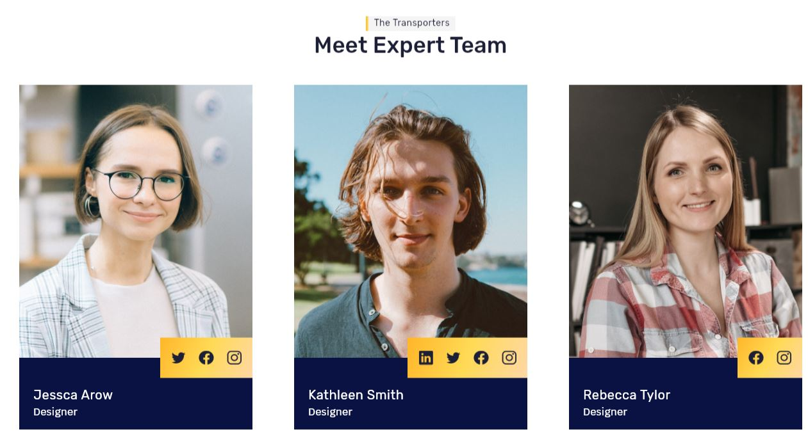

# Atomic Design

A practical example of how to apply atomic design in Flutter.


## Table of content

- [Step 0: Start](#step-0-start) 
- [Step 1: Setup Design library and showcase](#step-1-setup-design-library-and-showcase) 
- [Step 2: Atom Button](#step-2-atom-button) 
- [Step 3: Atom Heading](#step-3-atom-heading) 
- [Step 4: Atom Input](#step-4-atom-input) 
- [Step 5: Atom Social Info](#step-5-atom-social-info) 
- [Step 6: Atom Menu](#step-6-atom-menu) 
- [Step 7: Organism Menu Header](#step-7-organism-menu-header) 
- [Step 8: Page Section Banner](#step-8-page-section-banner) 
- [Step 9: Atom Stars](#step-9-atom-stars) 
- [Step 10: Atom User](#step-10-atom-user) 
- [Step 11: Molecule Review](#step-11-molecule-review) 
- [Step 12: Molecule Form](#step-12-molecule-form) 
- [Step 13: Atom Icon-Text](#step-13-atom-icon-text) 
- [Step 14: Atom Project-Image](#step-14-atom-project-image) 
- [Step 15: Atom Social Links](#step-15-atom-social-links) 
- [Step 16: Molecule Team Member](#step-16-molecule-team-member) 
- [Step 17: Atom Client](#step-17-atom-client) 
- [Step 18: Atom Date View](#step-18-atom-date-view) 
- [Step 19: Atom Bullet List](#step-19-atom-bullet-list) 
- [Step 20: Molecule News](#step-20-molecule-news) 
- [Step 21: Page Section Services](#step-21-page-section-services) 
- [Step 22: Page Section About - Part 1](#step-22-page-section-about---part-1) 
- [Step 23: Page Section About - Part 2](#step-23-page-section-about---part-2) 
- [Step 24: Page Section Projects](#step-24-page-section-projects) 
- [Step 25: Page Section Testimonials](#step-25-page-section-testimonials) 
- [Step 26: Page Section Why Us](#step-26-page-section-why-us) 
- [Step 27: Page Section Team](#step-27-page-section-team) 
- [Step 28: Page Section Contacts](#step-28-page-section-contacts) 
- [Step 29: Page Section Blog](#step-29-page-section-blog) 

## [Step 0: Start](https://github.com/Draxent/AtomicDesignFlutter/commit/50d199733b51df9f3d456bfffa7b8912d337f271)

Start the project from **step-0** by downloading [this file](steps/step0.zip) and enabling the web device for the project.

## [Step 1: Setup Design library and showcase](https://github.com/Draxent/AtomicDesignFlutter/commit/b8df720a0797241e62e2fc1d777d1ec821d4a5e7)
- Setup the design library
- Use [dashbook package](https://pub.dev/packages/dashbook) for the showcase of the design of the project

Run
```
 flutter create --template=package design
 cd design
 flutter create showcase
```

## [Step 2: Atom Button](https://github.com/Draxent/AtomicDesignFlutter/commit/d68f58dd6113b7d453fff51dbc0395c61fae5c6c)


## [Step 3: Atom Heading](https://github.com/Draxent/AtomicDesignFlutter/commit/85b7de593de279ce1ea6a9abf61c590027df8c37)


## [Step 4: Atom Input](https://github.com/Draxent/AtomicDesignFlutter/commit/3ee3b902d5ea1e87a1e8d58bf8f2a0c990a81c2c)


## [Step 5: Atom Social Info](https://github.com/Draxent/AtomicDesignFlutter/commit/c05bac6c0cc1ee8a2ff78ea3815360f1ce693fe8)


## [Step 6: Atom Menu](https://github.com/Draxent/AtomicDesignFlutter/commit/4085eac6c56b22b272938435f3f46d774f9c99ed)


## [Step 7: Organism Menu Header](https://github.com/Draxent/AtomicDesignFlutter/commit/566cc813af5198f1bc848d1a57954c7f2964c452)


## [Step 8: Page Section Banner](https://github.com/Draxent/AtomicDesignFlutter/commit/21df00faf8ebd860aaa6dc3f0c17215973ab94d6)


## [Step 9: Atom Stars](https://github.com/Draxent/AtomicDesignFlutter/commit/c95d3e0ee26d5727838aab1e882e9cd83586daa6)


## [Step 10: Atom User](https://github.com/Draxent/AtomicDesignFlutter/commit/d68d57232865828414500d7de0492dcba7c986ab)


## [Step 11: Molecule Review](https://github.com/Draxent/AtomicDesignFlutter/commit/13ae57f66e3b2a46eaac7cf46e959b74f59620d6)


## [Step 12: Molecule Form](https://github.com/Draxent/AtomicDesignFlutter/commit/f3a36ade5297610ce0807e63389049e798ac2911)


## [Step 13: Atom Icon-Text](https://github.com/Draxent/AtomicDesignFlutter/commit/551dcd6a1cdfc2a5f8b2b0e83b7d5c34653dc6f6)


## [Step 14: Atom Project-Image](https://github.com/Draxent/AtomicDesignFlutter/commit/e19d9b32cbdb4563c6c9f896bcd136c781086d67)


## [Step 15: Atom Social Links](https://github.com/Draxent/AtomicDesignFlutter/commit/e19d9b32cbdb4563c6c9f896bcd136c781086d67)


## [Step 16: Molecule Team Member](https://github.com/Draxent/AtomicDesignFlutter/commit/105326f24b57b4eeedb415b7c6962a1524658872)


## [Step 17: Atom Client](https://github.com/Draxent/AtomicDesignFlutter/commit/1d49d6dd0f04251cb36f45a75c430a19dc13dcbd)


## [Step 18: Atom Date View](https://github.com/Draxent/AtomicDesignFlutter/commit/d6f528e6b73ae13c5c270c4d2dd35882513da631)


## [Step 19: Atom Bullet List](https://github.com/Draxent/AtomicDesignFlutter/commit/39dd7e39f04bf31051decd90ced674dcd4b7b458)


## [Step 20: Molecule News](https://github.com/Draxent/AtomicDesignFlutter/commit/b032a64bd60522ac12f5d54244af001cc584f443)


## [Step 21: Page Section Services](https://github.com/Draxent/AtomicDesignFlutter/commit/986befbd542ccdaa80968e61447c9fc79dc6f8b5)


## [Step 22: Page Section About - Part 1](https://github.com/Draxent/AtomicDesignFlutter/commit/abbfc97ca75cd3b30c80bcf8b13ecb3e9390704c)


## [Step 23: Page Section About - Part 2](https://github.com/Draxent/AtomicDesignFlutter/commit/6ba9d4bb173b11796fc1913ca186f70819588b38)


## [Step 24: Page Section Projects](https://github.com/Draxent/AtomicDesignFlutter/commit/b5fe74ad4787798f621d5a3675a65692b624e969)


## [Step 25: Page Section Testimonials](https://github.com/Draxent/AtomicDesignFlutter/commit/3365726c7984bf18897582244b469a283daf8800)


## [Step 26: Page Section Why Us](https://github.com/Draxent/AtomicDesignFlutter/commit/b91b045959f8286d9f4262f64f34a75eaf71ad89)


## [Step 27: Page Section Team](https://github.com/Draxent/AtomicDesignFlutter/commit/044c5bafe26d3fc0ebe53b8f312e497d0a2aab1e)



## [Step 28: Page Section Contacts](https://github.com/Draxent/AtomicDesignFlutter/commit/53f991585a560009d6416d82e713955fc2d96035)


## [Step 29: Page Section Blog](https://github.com/Draxent/AtomicDesignFlutter/commit/2ab0ffa0c6dc28178cda5505ac6fd33d244c2b36)


## Links
- [Read more about atomic design](https://atomicdesign.bradfrost.com/chapter-2/)
- [Developing packages & plugins](https://docs.flutter.dev/packages-and-plugins/developing-packages)

## Credits/Material
- [Logistics Website Figma Template](https://www.freefigmatemplates.com/gallery/logistics-website-template) by [VictorFlow](https://www.figma.com/@victorflow)
- [Rubik font](https://fonts.google.com/specimen/Rubik)
- [Krub font](https://fonts.google.com/specimen/Krub)
