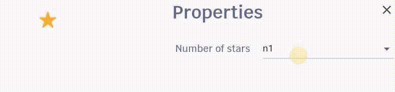

# Atomic Design

A practical example of how to apply atomic design in Flutter.

## Table of content

- [Step 0: Start](#step-0-start) 
- [Step 1: Setup Design library and showcase](#step-1-setup-design-library-and-showcase) 
- [Step 2: Atom Button](#step-2-atom-button) 
- [Step 3: Atom Heading](#step-3-atom-heading) 
- [Step 4: Atom Input](#step-4-atom-input) 
- [Step 5: Atom Social Info](#step-5-atom-social-info) 
- [Step 6: Atom Menu](#step-6-atom-menu) 
- [Step 7: Organism Menu Header](#step-7-organism-menu-header) 
- [Step 8: Page Section Banner](#step-8-page-section-banner) 
- [Step 9: Atom Stars](#step-9-atom-stars) 
- [Step 10: Atom User](#step-10-atom-user) 
- [Step 11: Molecule Review](#step-11-molecule-review) 
- [Step 12: Molecule Form](#step-12-molecule-form) 
- [Step 13: Atom Icon-Text](#step-13-atom-icon-text) 
- [Step 14: Atom Project-Image](#step-14-atom-project-image) 
- [Step 15: Atom Social Links](#step-15-atom-social-links) 
- [Step 16: Molecule Team Member](#step-16-molecule-team-member) 
- [Step 17: Atom Client](#step-17-atom-client) 
- [Step 18: Atom Date View](#step-18-atom-date-view) 
- [Step 19: Atom Bullet List](#step-19-atom-bullet-list) 

## Step 0: Start

Start the project from **step-0** by downloading [this file](steps/step0.zip) and enabling the web device for the project.

## Step 1: Setup Design library and showcase
- Setup the design library
- Use [dashbook package](https://pub.dev/packages/dashbook) for the showcase of the design of the project

## Step 2: Atom Button

## Step 3: Atom Heading

## Step 4: Atom Input

## Step 5: Atom Social Info

## Step 6: Atom Menu

## Step 7: Organism Menu Header

## Step 8: Page Section Banner

## Step 9: Atom Stars

## Step 10: Atom User

## Step 11: Molecule Review

## Step 12: Molecule Form

## Step 13: Atom Icon-Text

## Step 14: Atom Project-Image

## Step 15: Atom Social Links

## Step 16: Molecule Team Member

## Step 17: Atom Client

## Step 18: Atom Date View

## Step 19: Atom Bullet List

## Links
- [Read more about atomic design](https://atomicdesign.bradfrost.com/chapter-2/)
- [Developing packages & plugins](https://docs.flutter.dev/packages-and-plugins/developing-packages)

## Credits/Material
- [Logistics Website Figma Template](https://www.freefigmatemplates.com/gallery/logistics-website-template) by [VictorFlow](https://www.figma.com/@victorflow)
- [Rubik font](https://fonts.google.com/specimen/Rubik)
- [Krub font](https://fonts.google.com/specimen/Krub)
